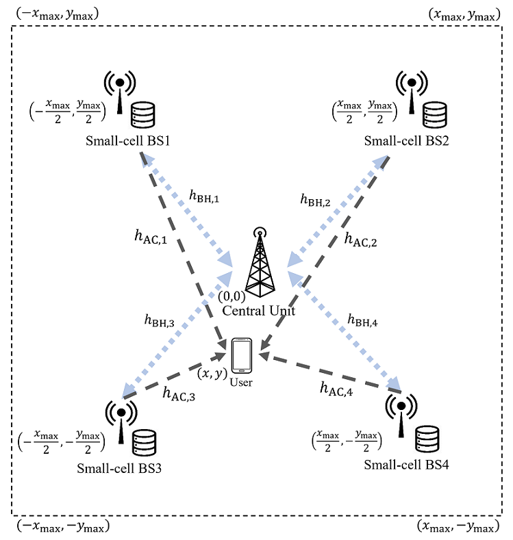
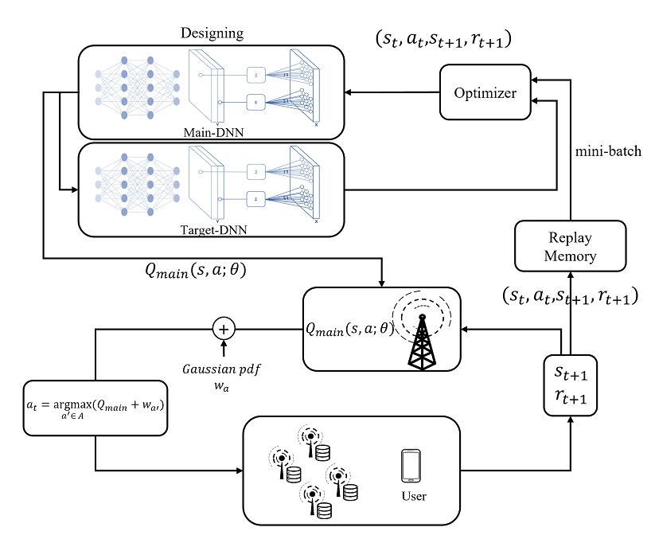

# Code in Cache_replacement_DRL
This is the code to show the results of the paper "Learning-Based Joint User Association and Cache Replacement in Small Cell Networks" by Sang eun jeon, Jae wook jung and Jun pyo hong.

The application uses Python backend on PyCharm: JetBrains. To run the code, you need the following Python library.
```c
# Require module
import torch
import numpy

# optional library
import random
import time
import matplotlib.pyplot
import collections
```

For training, the library was used Pytorch and used the version pytorch==1.8.0 torchvision==0.9.0 torchaudio==0.8.0 cudatoolkit=10.2. The project consists of Training.py, a learning and scenario progress code, Cache_Net_Environment.py, a network environment code, and a DNN_model.py, designed deep neural network (DNN) model. In addition, as described in the paper, test codes that can perform performance verification while changing various network environment variables were also prepared. I wanted to use an application that implements a wireless environment, but it was too complicated to configure a cache network, so I coded it myself and proceeded with the simulation.


### System model
<p align="center"></p>

## Deep reinforcement algorithm

We adopted DQN as our learning algorithm, and the learning process is illustrated in the block diagram below.
<p align="center"></p>
You can check the algorithm in Training.py.

## DNN_model
This is the code that designed the neural network structure. As shown in the paper, the DNN structure to be trained can be found in DNN_model.py. I went through a lot of trial and error to find the current effective DNN, and you can check the old DNN structure in the last_DNN_model folder.


## Performance test/DQN_test
This can confirm the performance results for the latency according to user association and cache replacement of the Deep reinforcement learning-based algorithm. The folder is composed of code for testing, and the training results of each DNN model are saved every 5000 episodes. This code can derive learning results according to three environment variables.

* Coverage (x_max, y_max)
```c
# -----main setting-----
coverage = 200 # Network coverage, range : [150, 300]
env = cache.cache_replacement(coverage, Zipf_ex, Mem)
```
* Content Popularity (Zipf's exponent)
```c
# -----main setting-----
Zipf_ex = 0.8 # popularity exponential, range : [0.3, 2.0]
env = cache.cache_replacement(coverage, Zipf_ex, Mem)
```
* Memory (cache capacity)
```c
# -----main setting-----
Mem = 16 # cache memory capacity range : [4, 24]
env = cache.cache_replacement(coverage, Zipf_ex, Mem)
```
Modify the following code in wireless_cache_network.py. After changing, run main_testing.py.

* Memory (cache capacity)
```c
# -----main setting-----
Mem = 16 # cache memory capacity range : [4, 24]
env = cache.cache_replacement(coverage, Zipf_ex, Mem)
```

## Non-stationary learning 
This is a learning and testing code in a non-stationary environment where the user's popularity in the network changes over time. The popularity change depends on the pop variable in the code. When the change_pop() function occurs during an episode, the request rank of each content rises by the amount of pop. At this time, in the case of content that has no higher rank, it is lowered to the lowest rank.
```c
pop = 5
env = cache.cache_replacement(pop)
...
if episode % 500 == 0 and episode != 0:
    env.change_pop()
```
Each variable can be modified in the following part of the main code.
